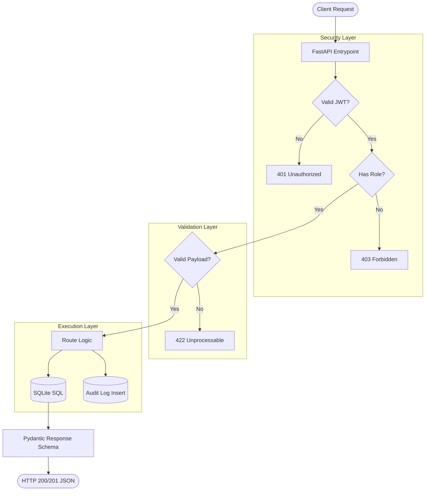

# Finance Data Processing Backend

A robust, lightweight, and clean FastAPI backend for financial record processing and role-based access control.

## ✨ Features
- **Role-Based Access Control (RBAC):** Admin, Analyst, and Viewer roles with strict permissions.
- **Financial Records Management:** Create, Read, Update, and Soft-Delete capabilities.
- **Dashboard & Analytics:** Real-time metrics for net balance, total income, and top expense categories.
- **Audit Logging:** Automated tracking of all record modifications.
- **Stateless JWT Auth:** Secure authentication using short-lived tokens.

## 🏗 Architecture



## 🛠️ Tech Stack
- **Framework:** FastAPI
- **Database:** Raw SQLite3
- **Authentication:** JWT (python-jose) & Bcrypt (passlib)
- **Validation:** Pydantic
- **Testing:** Pytest

## 🚀 Quick Start

### 1. Setup Environment
```bash
python3 -m venv venv
source venv/bin/activate
pip install -r requirements.txt
```

### 2. Initialize Database
Creates the initial tables and inserts dummy records for testing:
```bash
python -m backend.db.seed
```

### 3. Start the Server
```bash
uvicorn backend.main:app --port 8000 --reload
```
The API will be available at `http://127.0.0.1:8000`. 
Interactive Swagger API documentation is at `http://127.0.0.1:8000/docs`.

## 📡 API Explanation

The API provides clear boundaries for different operations based on roles. All protected routes require a Bearer JWT token in the `Authorization` header.

### 🔐 Auth Routes
| Method | Endpoint | Description | Access |
| :--- | :--- | :--- | :--- |
| `POST` | `/api/auth/login` | Authenticates a user and returns a stateless JWT. | Public |

### 📊 Dashboard Routes
| Method | Endpoint | Description | Access |
| :--- | :--- | :--- | :--- |
| `GET` | `/api/dashboard` | Retrieves high-level aggregations (net balance, income vs. expense, etc.) calculated natively in SQLite. | Admin, Analyst, Viewer |

### 📝 Records Routes
| Method | Endpoint | Description | Query / Path Params | Access |
| :--- | :--- | :--- | :--- | :--- |
| `GET` | `/api/records` | Retrieves paginated financial records. | `search`, `category`, `start_date`, `end_date`, `limit`, `offset` | Admin, Analyst |
| `POST` | `/api/records` | Creates a new financial record. Automatically sets `created_by`. | Body limits to expected fields | Admin, Analyst |
| `PUT` | `/api/records/{id}` | Updates an existing financial record. Maintains an audit trail. | `{id}` path param required | Admin, Analyst |
| `DELETE` | `/api/records/{id}` | Soft-deletes a financial record. Keeps the record in DB but marks `deleted_at`. | `{id}` path param required | Admin only |

> *Note: Every mutating `POST`, `PUT`, or `DELETE` action on a record automatically triggers an implicit insertion into the `audit_logs` table behind the scenes.*

## 🧪 Testing

**Run the automated test suite:**
```bash
pytest tests/
```

**Run the end-to-end API test script (via cURL):**
```bash
chmod +x test_api.sh
./test_api.sh
```

## 🔑 Sandbox Credentials
The following accounts are generated automatically when you seed the database:

| Role | Email | Password |
| :--- | :--- | :--- |
| Admin | `admin@finance.dev` | admin123 |
| Analyst | `analyst@finance.dev` | analyst123 |
| Viewer | `viewer@finance.dev` | viewer123 |

##  Assumptions Made
- **Small to Medium Scale:** Operating strictly on SQLite3 implies the focus is on simplicity, local-file constraints, and fast initial iteration rather than horizontal scalability or heavy concurrent writes.
- **Single-Tenant Structure:** All financial records are treated as belonging to a single organizational ledger (rather than individual users having their own private balances). Users access the same shared pool of data based on their role permissions.
- **Stateless Control:** Revoked users are validated instantly because `get_current_user` makes a quick query to verify user status despite using stateless JWTs.

##  Tradeoffs Considered
- **Raw SQL vs. ORM:** Opted against using ORMs (like SQLAlchemy) to maintain absolute control over the data layer and explicitly showcase database querying and logic structure, reducing abstraction magic at the cost of handwritten SQL boilerplate.
- **Soft Deletion Mechanism:** Deleting financial records permanently was avoided for audit traceability. When an admin "deletes" a record, it marks the timestamp in `deleted_at`. As a tradeoff, every read query explicitly ignores deleted records.
- **Database-Level Aggregation:** The dashboard routes calculate totals natively inside the database (`SUM`, `GROUP BY`) rather than fetching raw rows into Python. This is immensely faster, though it couples business reporting logic closely to SQLite syntax.

